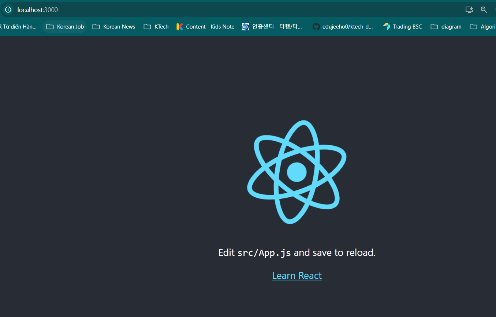

# Docker React Java MySQL
## 📖 Introduction
Docker-React-Java-MySQL is a full-stack application that includes:

- Frontend: React (running on Node.js)
- Backend: Spring Boot (Java 17)
- Database: MySQL.
  
The application leverages Docker Compose for deployment but requires building individual images for frontend and backend beforehand. Additionally, the project is integrated with a CI/CD pipeline using GitHub Actions, which automates the process of building, tagging, and pushing the Docker images to Docker Hub. This ensures a smooth workflow for deployment and version control of the frontend and backend components.
## Project Structure
```
.
├── .github/
│   └── workflows/
│       └── docker-image.yaml    # CI/CD Workflow on GitHub Actions
├── backend/
│   ├── Dockerfile               # Dockerfile for backend
│   └── ...                      # Backend source code (Spring Boot)
├── compose.yaml                 # Optional Docker Compose configuration
├── docker-compose.yaml          # Runs React, Java, MySQL
├── frontend/
│   ├── Dockerfile               # Dockerfile for frontend
│   └── ...                      # Frontend source code (React)
└── .env                         # Environment configuration file
```
## How to Use
### Setup .env File
Create a .env file in the root directory with the following content:
```
# MySQL Configuration
MYSQL_ROOT_PASSWORD=rootpassword
MYSQL_DATABASE=video_meeting
MYSQL_USER=dbuser
MYSQL_PASSWORD=dbpassword

# Docker Hub Configuration
DOCKER_USERNAME=your-dockerhub-username

# JWT Configuration (used in the backend)
JWT_SECRET_KEY=your-jwt-secret-key
```
### Buid Docker Images
#### Step 1: Build the frontend image and push dockerhub:
```
cd frontend
docker build -t video-meeting-app-frontend .  
docker tag video-meeting-app-frontend ${DOCKER_USERNAME}/video-meeting-app:frontend-latest  
docker push ${DOCKER_USERNAME}/video-meeting-app:frontend-latest  
```
#### Step 2: Build the backend image and push dockerhub:
````
cd backend
docker build -t video-meeting-app-backend .  
docker tag video-meeting-app-backend ${DOCKER_USERNAME}/video-meeting-app:backend-latest  
docker push ${DOCKER_USERNAME}/video-meeting-app:backend-latest   
````
#### Step 3: Run Docker Compose
After pushing the images, run:

```
docker-compose up -d
```
### CI/CD Workflow (GitHub Actions)
The CI/CD pipeline is managed using GitHub Actions. The workflow automates the process of building, tagging, and pushing the Docker images for both the frontend and backend to Docker Hub.

#### CI/CD Workflow File
The `.github/workflows/docker-image.yaml` file defines the steps for the CI/CD process. Here's a breakdown of the file:
```
name: Docker Image Delivery

on:
  workflow_dispatch:

jobs:
  deliver:
    runs-on: ubuntu-latest
    steps:
      - name: Checkout Source
        uses: actions/checkout@v4

      - name: Set Image Tag
        id: image-tag
        run: echo "TAG=$(date +%s)-ci" >> "$GITHUB_OUTPUT"

      - name: Build the Docker images
        env:
          TAG: ${{ steps.image-tag.outputs.TAG }}
        run: |
          docker build --file ./frontend/Dockerfile --tag "${{ secrets.DOCKER_USERNAME }}/video-meeting-app:frontend-$TAG" ./frontend
          docker build --file ./backend/Dockerfile --tag "${{ secrets.DOCKER_USERNAME }}/video-meeting-app:backend-$TAG" ./backend

      - name: Login To Docker Hub
        uses: docker/login-action@v3
        with:
          username: ${{ secrets.DOCKER_USERNAME }}
          password: ${{ secrets.DOCKER_PASSWORD }}

      - name: Push the Docker Images
        env:
          TAG: ${{ steps.image-tag.outputs.TAG }}
        run: |
          docker push "${{ secrets.DOCKER_USERNAME }}/video-meeting-app:frontend-$TAG"
          docker push "${{ secrets.DOCKER_USERNAME }}/video-meeting-app:backend-$TAG"

      - name: Tag Images as latest
        env:
          TAG: ${{ steps.image-tag.outputs.TAG }}
        run: |
          docker tag "${{ secrets.DOCKER_USERNAME }}/video-meeting-app:frontend-$TAG" \
          "${{ secrets.DOCKER_USERNAME }}/video-meeting-app:frontend-latest"
          docker tag "${{ secrets.DOCKER_USERNAME }}/video-meeting-app:backend-$TAG" \
          "${{ secrets.DOCKER_USERNAME }}/video-meeting-app:backend-latest"

      - name: Push latest
        run: |
          docker push "${{ secrets.DOCKER_USERNAME }}/video-meeting-app:frontend-latest"
          docker push "${{ secrets.DOCKER_USERNAME }}/video-meeting-app:backend-latest"
```
#### How it Works:
- **Checkout Source:** The workflow starts by checking out the source code from the repository.
- **Set Image Tag:** It sets a unique image tag based on the current timestamp.
- **Build Docker Images:** It builds the Docker images for both frontend and backend using the Dockerfile in each directory.
- **Login to Docker Hub:** Logs into Docker Hub using credentials stored in GitHub Secrets.
- **Push Docker Images:** Pushes the built images to Docker Hub with the generated tag.
- **Tag Images as Latest:** Tags the images with latest for easy reference.
- **Push Latest:** Finally, the images tagged as latest are pushed to Docker Hub.
#### Triggering the Workflow
This CI/CD workflow can be manually triggered via the GitHub Actions UI by clicking on the `Run workflow` button.

## Expected Result
After starting the application, run the following to verify the containers:

```
docker ps
```
You should see three containers running, with the port mappings as follows:
```
PS D:\01-BACK-END\01IdeaProjects\Docker-React-Java-MySQL> docker ps
CONTAINER ID   IMAGE                                            COMMAND                   CREATED          STATUS                    PORTS                               NAMES
8e4b5870e475   mysql:8.0                                        "docker-entrypoint.s…"   13 seconds ago   Up 13 seconds (healthy)   33060/tcp, 0.0.0.0:3307->3306/tcp   mysql-compose
eb6a4e0e2073   huongttt3506/video-meeting-app:frontend-latest   "docker-entrypoint.s…"   53 seconds ago   Up 12 seconds             0.0.0.0:3000->3000/tcp              frontend-compose
22a6799b82c0   huongttt3506/video-meeting-app:backend-latest    "/__cacert_entrypoin…"   53 seconds ago   Up 12 seconds             0.0.0.0:8080->8080/tcp              backend-compose
PS D:\01-BACK-END\01IdeaProjects\Docker-React-Java-MySQL>
```
After the application starts, navigate to:
- Frontend: [localhost:3000](http://localhost:3000)
- Backend: [localhost:8080](http://localhost:8080)
- MySQL: localhost:3307




Stop and Remove the Containers
To stop and remove the containers, run:

```docker-compose down```


